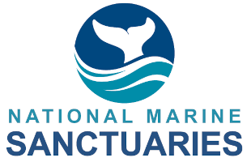

Easy access to information for tracking ecosystem conditions, human connections and management impacts are critical to timely, effective and community-based resource management. Through an exciting collaboration that leverages expertise across NOAA's IOOS Program (including the [Marine Biodiversity Observation Network](https://marinebon.org)), [Integrated Ecosystem Assessment (IEA) Program](https://www.integratedecosystemassessment.noaa.gov/), [National Centers for Coast and Ocean Science (NCCOS)](https://coastalscience.noaa.gov/) and the [Office of National Marine Sanctuaries (ONMS)](https://sanctuaries.noaa.gov/), we are developing web-based, interactive tools to track and better understand the changing nature of sanctuary ecosystems. These user-friendly tools bring ecosystem tracking and assessment information to the fingertips of resource managers, scientists, educators, and the public.

## Goals

-   Develop science-based data visualization and outreach tools that enhance accessibility to routinely updated monitoring data and provide scientific support for ONMS management.
-   Leverage strengths of different NOAA programs and partners to build new synergies

## Partners

[{height="56px"}](https://www.integratedecosystemassessment.noaa.gov/partners/national-marine-sanctuaries)    [{height="56px"}](https://ioos.us/)    [{height="56px"}](https://marinebon.org/)    [{height="56px"}](https://coastalscience.noaa.gov/ )    [{height="56px"}](https://sanctuaries.noaa.gov/science/)

## More Information

For more information about this approach:

- [Sanctuary Watch Fact Sheet](FactSheetDec2022.pdf)

-   [Developing Science-Based Indicator Portfolios For National Marine Sanctuary Condition Reports](https://sanctuaries.noaa.gov/science/conservation/2019-science-based-indicator-portfolios.html)

-   [Webenizing Condition Reports: Communicating Data-Driven Ecosystem Indicators in a Visually Engaging and Interactive Online Platform](https://sanctuaries.noaa.gov/science/conservation/webenizing-condition-reports.html)

-   [Guide to the Infographiq software library for displaying data](https://marinebon.org/infographiq/)

-   [Place-Based Ecosystem Management: Adapting Integrated Ecosystem Assessment Processes for Developing Scientifically and Socially Relevant Indicator Portfolios](https://doi.org/10.1080/08920753.2021.1846154)

-   [Improving the IEA Approach Using Principles of Open Data Science](https://www.tandfonline.com/doi/pdf/10.1080/08920753.2021.1846155)

-   [A quantitative and qualitative decision-making process for selecting indicators to track ecosystem condition](https://doi.org/10.1016/j.marpol.2021.104489)

-   [Marine Biodiversity Observation Network (MBON) Product Inventory: Data & Software](https://marinebon.org/data-products) (beta)
